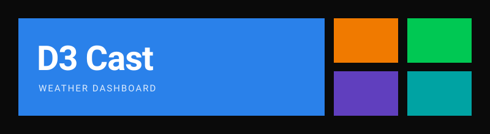

  
    

  
  
  
  
    
  

## 🌟 Про проєкт

**D3 Cast** — це некомерційний web-додаток для тих, хто цінує чистий дизайн та швидкість. Жодної реклами, складних бекендів чи зайвого візуального шуму. Лише точні метеодані, загорнуті у строгий плитковий інтерфейс, який динамічно адаптується до того, що зараз відбувається за вашим вікном.

Проєкт створено з акцентом на продуктивність: він не використовує важких JS-фреймворків, покладаючись виключно на нативні веб-технології.

## ✨ Головні фішки

- 🎨 **Динамічне середовище**: Кольорова палітра інтерфейсу автоматично змінюється залежно від погодних умов (сонячно, дощ, шторм, сніг) та часу доби (світла/темна тема для дня і ночі).
- ⚡ **Zero Dependencies**: Жодних сторонніх бібліотек чи фреймворків для UI. Тільки чистий Vanilla JS та сучасний CSS.
- 📱 **PWA (Progressive Web App)**: Встановлюйте D3 Cast на головний екран смартфона чи ПК. Працює як повноцінний нативний додаток.
- 🔔 **Розумні Push-сповіщення**: Отримуйте локальні нагадування перевірити прогноз у зручний для вас час (реалізовано через Notifications API).
- ⚙️ **Гнучка кастомізація**: Метрична чи імперська система? Обирайте самі. Підтримка налаштувань температури, швидкості вітру та атмосферного тиску.
- 💾 **Повна автономність**: Усі ваші налаштування та обрані локації зберігаються виключно у вашому браузері (`localStorage`). Ніякого збору даних.
